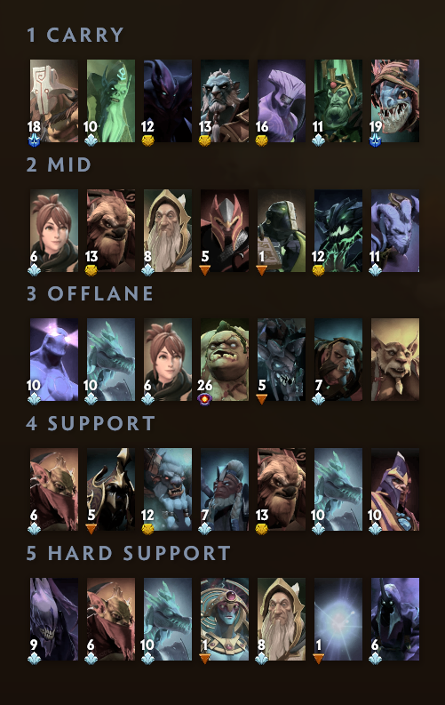

# Dota 2 Meta Grid

**Climb MMR by picking the heroes that are actually winning this patch - shown right in your hero picker.**

<p align="center">
  
</p>

Your MMR comes down to two numbers: **how many games you play** and **how far above 50% you
win them**. This tool works on the second one. It takes live pub win rates, keeps the heroes
that win the most in each role on the current patch, throws out the ones that lose at *your*
rank, and installs the result as an in-game hero grid - best pick on the left.

Free. No Dota Plus, no accounts, no API keys.

## The MMR math

> **MMR gained = games x (2 x win rate - 1) x 25**

A ranked game is worth about 25 MMR either way. At 50% you stay where you are, forever. Every
point above 50% is worth about half an MMR per game:

| Your win rate | MMR per 100 games | Games to climb one medal (~770 MMR) | Games until you're 5-in-6 sure to be up* |
|---:|---:|---:|---:|
| 50% | 0 | - | - |
| 51% | +50 | ~1,540 | ~2,500 |
| 52% | +100 | ~770 | ~625 |
| 53% | +150 | ~510 | ~280 |
| 55% | +250 | ~310 | ~100 |

\* Luck swings your MMR by about 25 x sqrt(games). Your edge only outgrows that after roughly
1 / (2 x win rate - 1)^2 games.

Three things follow from this table:

1. **Small edges are the whole game.** Nobody holds 60% at their own rank. A steady 52-53% is
   what a climbing account looks like.
2. **A hundred games prove very little.** A genuine 52% player is still *down* after 100 games
   almost a third of the time. Don't drop a hero - or your mental - over one bad week.
3. **There are only two levers: play more, and win slightly more often.** The draft is the
   cheapest place to find "slightly more": it costs no mechanics, no warding guide, no coach.

## What the grid adds

We tested the ranking out of sample, on games it had never seen: the top 3 heroes it picked
per role won about **4 points more** than the average hero in that role, the top 7 about
**3 points more** (in top-level pubs). You won't capture all of that - but even half of it is
the jump from the 50% row to the 52% row above.

How to use it:

- **Take the leftmost hero that isn't banned or taken.** Rows are sorted best-first, so when
  your pick gets sniped you just move right instead of panicking.
- **Pick two or three heroes per role and spam them.** Meta only pays if you can play the hero:
  a +3 hero you pilot badly is a losing pick. From each row, take the ones you're already
  decent at.
- **Use it for early picks.** It answers "what wins on average". With last pick, counter-pick.
- **Refresh it weekly**, and again about five days after every patch.

## Get your grid in two minutes

**With Claude Code or Codex** - paste this into your agent:

> Install the skill from https://github.com/Kocher1/dota2-meta-grid and build my Dota 2 hero grid.

It asks for your rank, the roles you play and how many heroes you want per row, checks with
you before keeping specialist heroes (Meepo, Visage and friends), then writes the grid. Close
Dota when it asks, reopen it, go to **Heroes** and choose **Meta Grid** in the grid dropdown.

<details>
<summary>Install the skill by hand</summary>

```bash
# Claude Code
git clone https://github.com/Kocher1/dota2-meta-grid ~/.claude/skills/dota2-meta-grid
# Codex
git clone https://github.com/Kocher1/dota2-meta-grid ~/.codex/skills/dota2-meta-grid
```

Then say *"build my Dota hero grid"*.
</details>

**Without any AI** - you only need Python 3.8+:

```bash
git clone https://github.com/Kocher1/dota2-meta-grid
cd dota2-meta-grid
python scripts/build_grid.py --rank 3400                      # shows the ranking, writes nothing
python scripts/build_grid.py --rank 3400 --roles 1,2 --write  # installs it (close Dota first)
```

`--rank` takes an MMR number or a medal. Built and tested on Windows; Linux and macOS paths
are supported but less tested - if your Steam folder isn't found, pass `--steam-dir`. Your
existing grids are kept and the old file is backed up.

## Will it work at my rank?

Best from **Ancient upward**. Role-by-role win rates only exist for top-level pubs (6500+ MMR),
and a hero's edge there doesn't fully survive the trip down: about 90% of it carries over at
Divine, 75% at Ancient, 55% at Legend, under half at Archon and below. Whatever your rank,
heroes that are losing in *your* bracket are removed - so lower-ranked players still get a
sane list, but should treat it as a starting point and be wary of heroes that need a
coordinated team.

Medal to MMR, for reference (approximate - Valve's July 2026 rescale only compressed Immortal
numbers, Divine and below are unchanged):

| Medal | MMR | Medal | MMR |
|---|---|---|---|
| Herald | 0 - 769 | Legend | 3,080 - 3,849 |
| Guardian | 770 - 1,539 | Ancient | 3,850 - 4,619 |
| Crusader | 1,540 - 2,309 | Divine | 4,620 - 5,619 |
| Archon | 2,310 - 3,079 | Immortal | 5,620+ |

## How the ranking is made

- **Win rate per role**, from top-level pubs on the current patch.
- **No small-sample heroes on top.** 60% over 130 games is mostly luck, so it is treated as
  roughly 52%. In our backtests this one correction beat ranking by raw win rate.
- **Patch-aware.** Games from before the patch count as a starting guess, not as truth; heroes
  the patch touched are allowed to move fast.
- **Your bracket has a veto.** Below 49% at your rank means out, however good the hero looks
  at the top.
- **Specialist heroes are your call.** Meepo, Visage or Lone Druid really do win - for the few
  people who spam them. You get asked before they stay in a row.
- **Your own record is a tie-breaker**, read locally from Dota's files and worth at most
  1.5 points. Meta first.

An example of what sits behind a row (patch 7.41f, 17 Sep 2026, player at Ancient):

```
4 Support                 edge over an average pos 4     win rate in your bracket
   Bounty Hunter                  +7.2                          55.2%
   Nyx Assassin                   +3.8                          52.5%
   Spirit Breaker                 +2.9                          52.2%
   removed (losing in your bracket): Clockwerk 48.4%
```

Every number and rule above was chosen by backtest. The tests, results and known limits are
in [references/METHOD.md](references/METHOD.md).

## FAQ

**Is this safe for my account?** It edits `hero_grid_config.json`, the same settings file the
in-game grid editor saves. It never touches the game process or memory, and it refuses to
write while Dota is running.

**Do I need Dota Plus?** No.

**Where does the data come from?** Role statistics from
[Dota2ProTracker](https://dota2protracker.com), bracket win rates from
[OpenDota](https://www.opendota.com), patch notes from dota2.com. The script is a polite
client: about a dozen small requests per run, paced and cached for six hours. If you use this
a lot, consider supporting those sites - they do the hard part.

**It says the site refused the request.** The stats site rate-limits scripts. Wait 15-30
minutes and run it again; finished downloads are cached.

**Does it look at counters or my team's draft?** No - see "Use it for early picks" above.

## Who made this

The team behind **[OVERDOG](https://overdog.bet)** - Dota 2 betting against other fans instead
of a bookmaker. Think you read the pro meta as well as your pubs? That's the place. *18+*

## License

MIT. Not affiliated with Valve, Dota2ProTracker or OpenDota. Dota 2 is a trademark of Valve Corporation.
